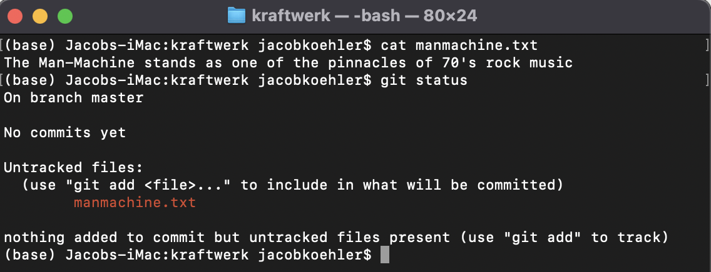

#Introduction
This is a Required Assignment 5.1 for an AI/ML class from UC Berkeley, 2025.

## Jupyter Notebook

You can view the full analysis and code in the Jupyter notebook: [assignment_5.1.ipynb](assignment_5.1.ipynb)

## Summary of Findings

- **Overall Coupon Acceptance:** The acceptance rate for coupons varies by type, with some types (e.g., Coffee House, Carry out & Take away) having higher acceptance among certain demographic groups.
- **Bar Coupons:** Drivers who visit bars more frequently, are over 25, do not have kids as passengers, and are not in farming/fishing/forestry occupations are more likely to accept bar coupons.
- **Demographics:** Younger drivers (age ≤ 31), those with lower income (≤ $50K), and those who are single or married partners show higher acceptance rates for several coupon types.
- **Din-in vs Take-out:** Drivers who dine in at restaurants more often are more likely to accept restaurant coupons compared to those who prefer take-out.
- **Target Groups:** The analysis suggests that targeting younger, lower-income drivers, especially those who frequent bars or dine in, can maximize coupon acceptance rates.

These findings can help businesses optimize coupon distribution strategies to reach the most receptive customer segments.

### Key Visualizations

**Coupon Acceptance by Type**

**Acceptance Rate by Demographics**

**Bar Coupon Analysis**

**Dine-In vs Take-Out Acceptance**

## Findings

### Problem Statement
This analysis focuses on understanding the factors that influence whether a customer will accept a coupon for a specific group—such as bar coupons, restaurant coupons, or coffee house coupons. The goal is to identify key demographics and/or other characteristics that help decide those who accept from those who reject the coupon.

### Visualizations
- Bar plots and countplots were used to compare coupon acceptance rates across different types and demographic groups.
- Boxplots and histograms visualized the distribution of continuous variables (e.g., temperature) and their relationship to coupon acceptance.
- Grouped visualizations highlighted differences in acceptance rates by age, income, marital status, and frequency of visits to bars or restaurants.

### Interpretation of Statistics
- Descriptive statistics showed that younger drivers (≤ 31 years), lower-income individuals (≤ $50K), and those who are single or married partners are more likely to accept coupons.
- Making specific subgroups and analyzing the given subgroup revealed that frequent bar-goers, especially those over 25 and without kids as passengers, have a significantly higher acceptance rate for bar coupons.
- Dine-in restaurant patrons are more likely to accept restaurant coupons than those who prefer take-out.

### Actionable Findings
- Target coupon distribution to younger, lower-income drivers, especially those who frequent bars or dine in at restaurants.
- Avoid targeting bar coupons to individuals  who typically have kids as passengers.

### Next Steps and Recommendations
- Deep dive into sub categories and find the specific target group where coupon acceptance rate is higher.
- Explore additional contextual factors (e.g., weather, time of day, driving direction) to optimize coupon delivery timing.

These steps will help maximize coupon acceptance rates and improve the efficiency of marketing efforts.
